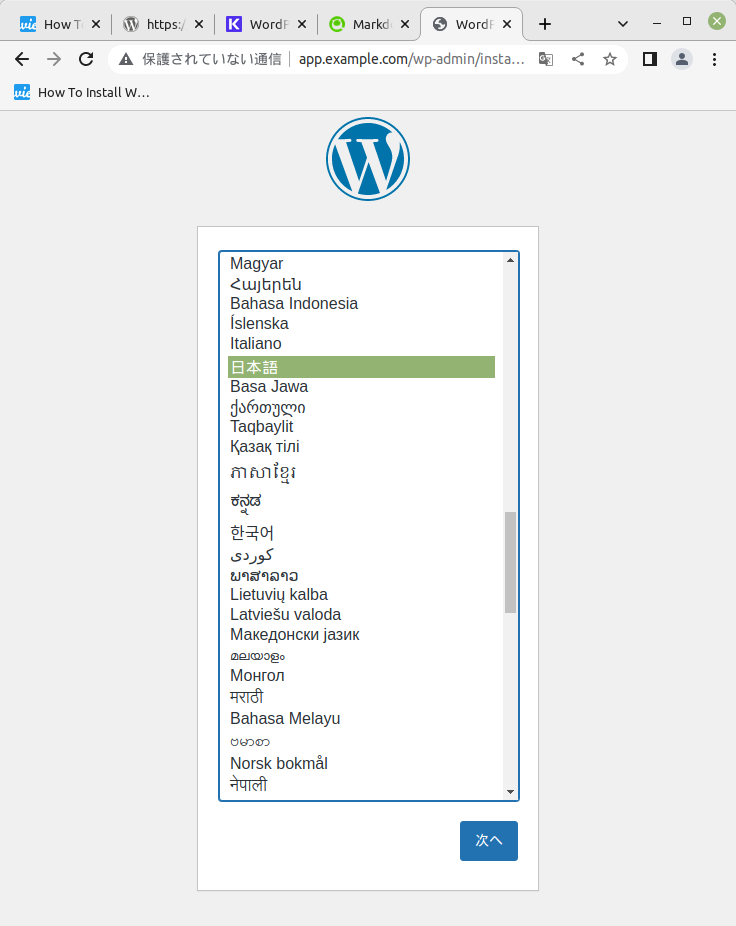
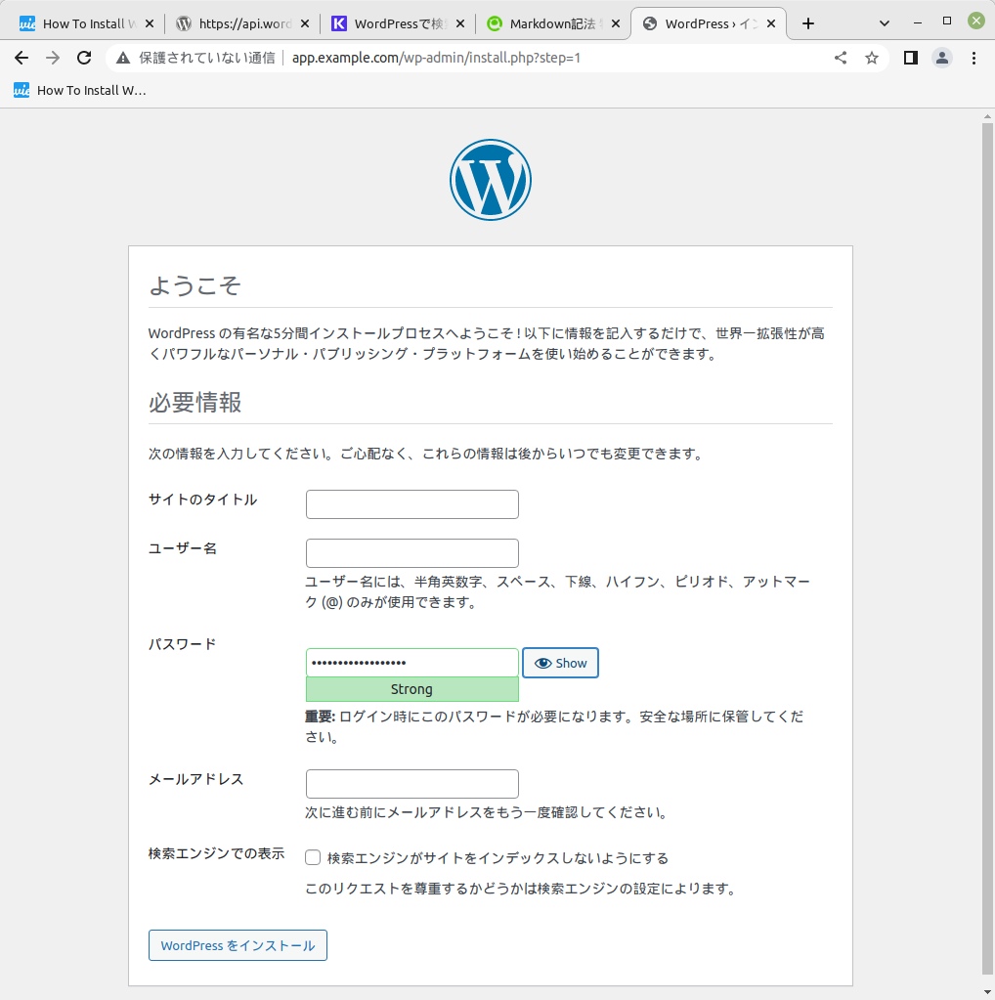
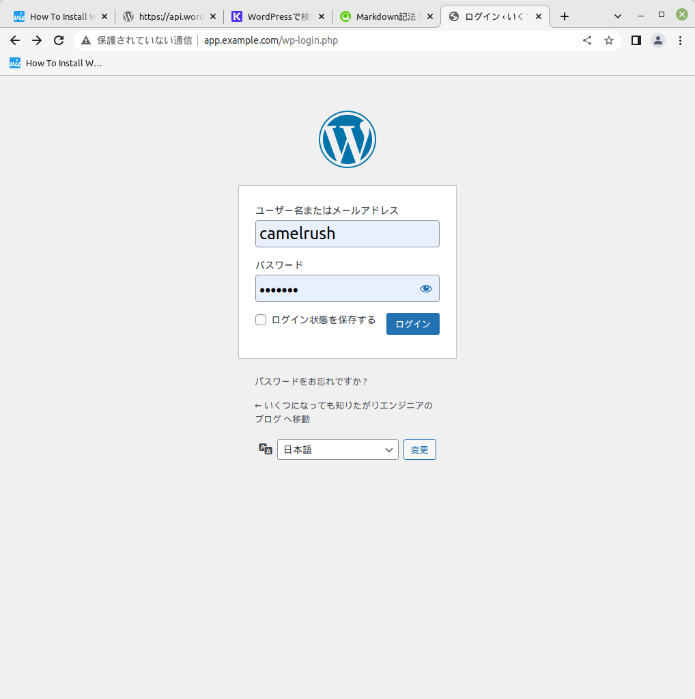
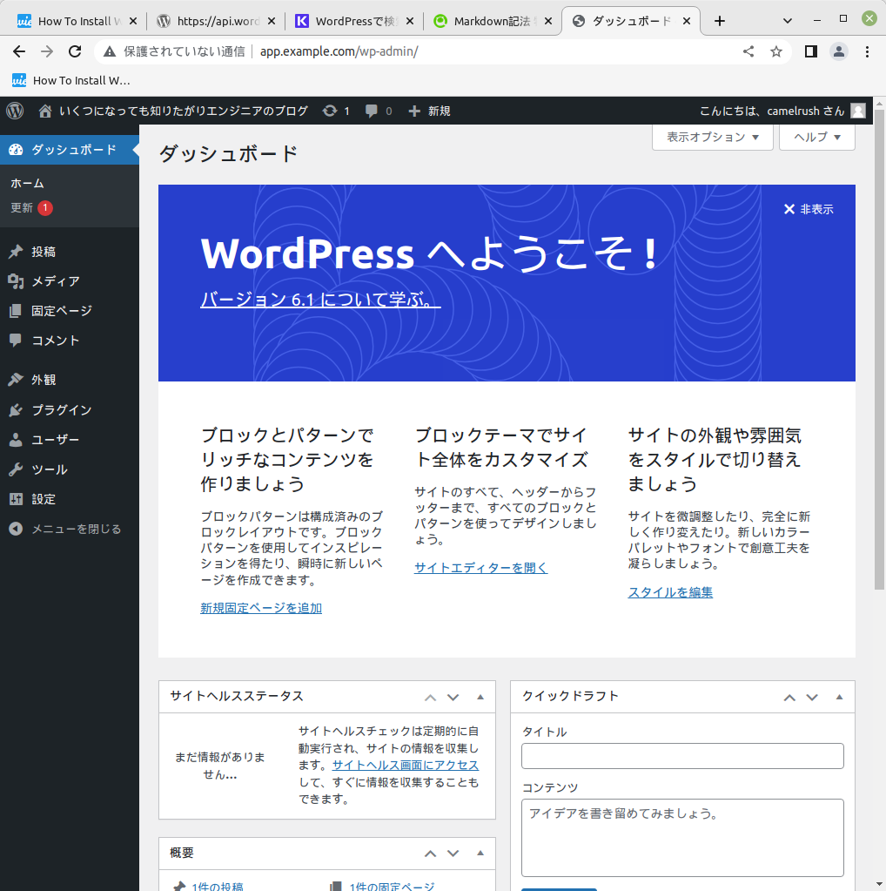

## 参考ページ
-  [How To Install WordPress on Linux Mint 21](https://techviewleo.com/how-to-install-wordpress-on-linux-mint/)

 

## MariaDBセットアップ

### インストール
- 最初にデータベースとしてMariaDBをインストールする。  
  > sudo apt install vim mariadb-server mariadb-client

- MariaDBをサービス有効化し、OS起動時にサ ービス起動するよう設定する。  
  > sudo systemctl start mariadb.service  
  > sudo systemctl enable mariadb.service

- MariaDBをセキュアに運用するため、パスワード設定、匿名ログイン削除等を行う。  
  >  sudo mysql_secure_installation  

- 実行後の入力には、以下のとおり応答すること。
  - Enter current password for root (enter for none): `空のままEnter`
  - Set root password? [Y/n]: Y
  - New password: `任意のパスワードを入力`
  - Re-enter new password: `パスワードを再入力`
  - Remove anonymous users? [Y/n]: Y
  - Disallow root login remotely? [Y/n]: Y
  - Remove test database and access to it? [Y/n]: Y
  - Reload privilege tables now? [Y/n]: Y

### データベース構築
- MariaDBにログインする。  
  > sudo mysql -u root -p

- CREATEコマンドでデータベースを作成する。   
  > CREATE DATABASE wp_website;

- 作成したDBにユーザwp_userからのアクセス権と、パスワードを設定する。   
  >  GRANT ALL PRIVILEGES ON wp_website.* TO 'wp_user'@'localhost' IDENTIFIED BY '`任意のパスワード`';  
  > FLUSH PRIVILEGES;  
  > EXIT

 

## WordPressセットアップ

### nginxインストール
- 最初に、nginxをインストールする
  > sudo apt install nginx -y

### WordPressインストール
- WordPressをサイトから/tmpにダウンロードし、解凍する。  
  > cd /tmp  
  > wget https://wordpress.org/latest.tar.gz  
  > tar -zxvf latest.tar.gz

- この後の作業のため、環境変数を設定する。
  > WEBSITE_NAME="wp_website"  

- 解凍したwordpressディレクトリを実行パスに配置する。
  > \# ディレクトリをnginxの参照パス「/var/www/html」に移動  
  > sudo mv wordpress /var/www/html/$WEBSITE_NAME  
  >  
  > \# ディレクトリのownerを変更  
  > sudo chown -R www-data:www-data /var/www/html/$WEBSITE_NAME  
  >  
  > \# ディレクトリの権限を変更  
  > sudo chmod -R 755 /var/www/html/$WEBSITE_NAME/

-  環境設定ファイルを作成する（サンプルの「wp-config-sample.php」を使う）
    > sudo mv /var/www/html/$WEBSITE_NAME/wp-config-sample.php /var/www/html/$WEBSITE_NAME/wp-config.php

- テキストエディタ（nanoなど）で、環境設定ファイルを開く  
  > sudo nano /var/www/html/$WEBSITE_NAME/wp-config.php
  - 以下の３箇所を変更する。
    - define('DB_NAME', 'wp_website');
    - define('DB_USER', 'wp_user');
    - define('DB_PASSWORD', '`データベース作成時に登録したパスワード`');
  - さらに、以下の設定内容を登録する。設定する値は[こちらのサイト](https://api.wordpress.org/secret-key/1.1/salt/)でランダム値の取得ができる。
    - define('AUTH_KEY',         'D4-$ub(ChcN~aknyLt9a?X4?)sg9H>#(?-*1vY|Q1~>~Bt`q1w)-6}cXqV>{zV!5');
    - define('SECURE_AUTH_KEY',  'Lg]shyN@0a/2Hjm8l-3E+aCi?~&/d:2=YB{Vv%-v$65wpwz*$(6}u$a%g3()4x_W');
    - define('LOGGED_IN_KEY',    'e&IYLA6m+K|_+qy Fa|hRu!N3B!KupoI|E:Q$SrA$^ onVh5S:KzUN$&w^Fj`z,.');
    - define('NONCE_KEY',        'S^#|5<`k8iOS;E8+Y^:9za+|LlYYn*)na$[=&D{)%aS0Mh$$uFmtc^LHK%m3BRY*');
    - define('AUTH_SALT',        '7ho|zJGidGt!4DAJ4(4{%J;_,=#|cmd%M1YHr7PC=IaRO2-;AhwGI>P^NC:m>7On');
    - define('SECURE_AUTH_SALT', 'j1_}K:zFHPRKNE[1O2G~?J561k6a$>.wxC`/~&-|V|<~h$-DbT2ik52tV3Ij9(!');
    - define('LOGGED_IN_SALT',   'K@Nh+#w@0IQ76OK)?b^[S%WR2Z02H@}O}p*$~tSvPL5XToHEB8>s=:=&-DI)gv,p');
    - define('NONCE_SALT',       ')8fi9{rT,Uz+Wg:UcwbhjA/@-(Cw&^WVCGV&vF~u0^^,WLL^m=1klmovged+bq-D');

### nginxをセットアップする

- PHP環境をインストールする
  > sudo apt install php php-cli php-fpm php-json php-pdo php-mysql php-zip php-gd  php-mbstring php-curl php-xml php-pear php-bcmath -y

- 環境変数としてドメイン名「WP_DOMAIN」を設定する
  > WP_DOMAIN="app.example.com"

- 設定したドメイン名を、hostsファイルに登録しておく。
  > sudo nano /etc/hosts  
     - 127.0.0.1 app.example.com

- nginx環境設定ファイルを作成して保存する。
  > sudo tee /etc/nginx/sites-available/`$WEBSITE_NAME`.conf<<EOF  
  > server {  
  > listen 80;  
  > 	listen [::]:80;  
  > 	server_name `$WP_DOMAIN` www.`$WP_DOMAIN`;  
  > 	root /var/www/html/`$WEBSITE_NAME`;  
  > 	index index.php index.html index.htm;  
  > 	location / {  
  > 		try_files \$uri \$uri/ index.php?\$args;  
  > 	}  
  > 	location ~ \.php\$ {  
  > 		include snippets/fastcgi-php.conf;  
  > 		fastcgi_pass unix:/run/php/php-fpm.sock;  
  > 		fastcgi_param	SCRIPT_FILENAME \$document_root\$fastcgi_script_name;  
  > 	}  
  > }  
  > EOF  

- 以下のコマンドで環境変数の設定に誤りがないか、チェックする。
  > sudo nginx -t
  > > nginx: the configuration file /etc/nginx/nginx.conf syntax is ok  
  > > nginx: configuration file /etc/nginx/nginx.conf test is successful  
  >  \# ↑ このように出力されればOK。

- nginxのサービスを再起動する。
  > sudo ln -s /etc/nginx/sites-available/$WEBSITE_NAME.conf /etc/nginx/sites-enabled/    
   > sudo systemctl restart nginx.service   
   > sudo systemctl restart php*-fpm.service  

## WordPressにアクセスする
- ブラウザのアドレスにhttp://app.example.com を入力してWordPressにアクセスする。  

  

- 言語選択をした後、サイト情報、ユーザ設定を行う。

  

- ログインを実行する

  

- 以下のトップページが表示されればOK。

  
  
おつかれさまでした。。。
